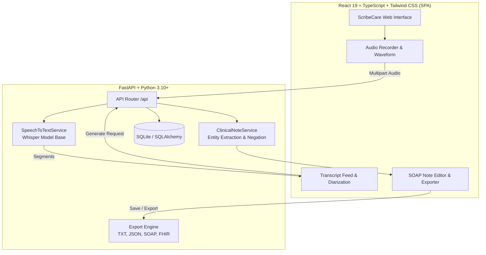

# ScribeCare — Ambient AI Clinical Scribe

[](https://www.python.org/downloads/)
[](https://nodejs.org/)
[](https://fastapi.tiangolo.com/)
[](https://react.dev/)
[](https://tailwindcss.com/)
[](LICENSE)

**ScribeCare** securely transforms ambient doctor–patient consultations (audio or live microphone) into accurate, structured clinical SOAP notes (Chief Complaint, History of Present Illness, Assessment, and Plan).

---

## 1. System Architecture



---

## 2. Prerequisites

1. **Python:** 3.10 or higher (tested on Python 3.14)
2. **Node.js:** 18.x or higher (tested on Node v24)
3. **FFmpeg:** Required by OpenAI Whisper for live audio decoding.
   - **Windows:** Run `winget install Gyan.FFmpeg` or extract binaries from [gyan.dev/ffmpeg/builds](https://www.gyan.dev/ffmpeg/builds/) and add `bin/` to system `PATH`.
   - **macOS:** Run `brew install ffmpeg`
   - **Ubuntu/Debian:** Run `sudo apt update && sudo apt install -y ffmpeg`
   *(Note: You can run and test the full application without FFmpeg by enabling **Mock Mode**).*

---

## 3. Quick Start (Development Mode)

### Step 1: Install Python Dependencies & Seed Database
```bash
# Install backend dependencies
pip install -r requirements.txt

# Seed SQLite database with demo patients
python -m backend.seed
```

### Step 2: Install Frontend Dependencies
```bash
cd frontend
npm install
cd ..
```

### Step 3: Run Development Servers
Open two terminal windows:

**Terminal 1 (Backend API on port 8000):**
```bash
uvicorn backend.main:app --reload --port 8000
```

**Terminal 2 (Frontend Vite Dev Server on port 5173):**
```bash
cd frontend
npm run dev
```

Visit **`http://localhost:5173`** in your browser.  
Interactive API documentation is accessible at **`http://localhost:8000/docs`**.

---

## 4. Production Build & Unified Server

To build the optimized React frontend and serve both the SPA and REST API from a single FastAPI process:

```bash
# 1. Build the production React frontend
cd frontend
npm run build
cd ..

# 2. Run the production Uvicorn server
uvicorn backend.main:app --host 0.0.0.0 --port 8000
```

Visit **`http://localhost:8000`** in your browser.

---

## 5. Zero-Dependency Mock Mode

To run and evaluate the complete ScribeCare experience without needing GPU hardware, Whisper model downloads, or system FFmpeg:

1. Create a `frontend/.env.local` file:
   ```env
   VITE_USE_MOCK=true
   ```
2. Start the frontend:
   ```bash
   cd frontend && npm run dev
   ```
With `VITE_USE_MOCK=true`, the interface simulates real-time microphone capture, loads clinical regression transcripts, synthesizes structured SOAP notes, and tests approval and export flows seamlessly.

---

## 6. Environment Variables (`.env.example`)

| Variable | Default | Description |
|---|---|---|
| `DATABASE_URL` | `sqlite:///./scribecare.db` | SQLAlchemy SQLite database path |
| `WHISPER_MODEL` | `base` | Whisper model tier (`tiny`, `base`, `small`, `medium`) |
| `PORT` | `8000` | Port for the FastAPI server |
| `HOST` | `127.0.0.1` | Host binding interface |
| `VITE_USE_MOCK` | `false` | Enables client-side mock data mode in the frontend |

---

## 7. API Summary

| Method | Endpoint | Description |
|---|---|---|
| `GET` | `/api/health` | Returns health status, Whisper model state, and FFmpeg detection. |
| `GET` | `/api/patients` | Returns registered clinic demo patients. |
| `POST` | `/api/transcribe` | Transcribes multipart audio into speaker-attributed segments. |
| `POST` | `/api/notes/generate` | Synthesizes structured clinical SOAP notes with negation extraction. |
| `GET` | `/api/notes` | Lists saved clinical notes. |
| `GET` | `/api/notes/{id}` | Retrieves a single clinical note by ID. |
| `PUT` | `/api/notes/{id}` | Updates note sections (inline edits) and approves note (`draft` $\rightarrow$ `reviewed`). |
| `POST` | `/api/notes/{id}/export` | Exports note in `txt`, `json`, `soap`, or `fhir` (501 status) format. |
| `POST` | `/api/demo-requests` | Validates and stores commercial enterprise demo inquiries. |

---

## 8. Automated Testing

### Run Backend Pytest Suite
```bash
python -m pytest tests/ -v
```
*Tests verify API health, FFmpeg error propagation, Whisper transcription mocking, regression fixtures (duration extraction and NegEx negation), note CRUD, multi-format export, and demo request validation.*

### Run Frontend Vitest Suite
```bash
cd frontend
npm test
```
*Tests verify language switcher reactivity (`en`/`hi`/`te`), inline note editing, approval toggle, export menu interactions, and modal validation.*

---

## 9. Regulatory & Clinical Safety Notice

> [!IMPORTANT]
> **Clinical Review Mandate:** ScribeCare generates draft documentation. All clinical notes must be reviewed, verified, and signed by a licensed medical provider before becoming part of the permanent medical record.

> [!NOTE]
> **HIPAA-Ready Architecture:** ScribeCare is built with HIPAA readiness in mind (local on-premise execution capability, zero logging of raw transcripts or PHI to standard output, isolated database storage). Complete HIPAA compliance requires organizational business associate agreements (BAAs), access controls, and encryption at rest in your hosting infrastructure.
