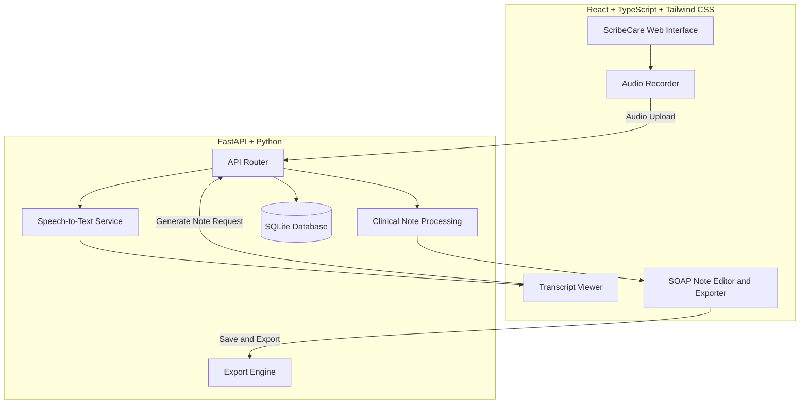

# ScribeCare — Ambient AI Clinical Scribe

[](https://www.python.org/downloads/)
[](https://nodejs.org/)
[](https://fastapi.tiangolo.com/)
[](https://react.dev/)
[](https://tailwindcss.com/)
[](LICENSE)

**ScribeCare** is an AI-powered clinical documentation assistant designed to transform doctor–patient consultations into structured clinical notes using audio transcription and clinical text processing.

The goal is to reduce documentation workload and help healthcare professionals prepare organized clinical records.

> **Clinical safety:** ScribeCare generates draft documentation. A qualified healthcare professional must verify and approve every note before clinical use.

---

## 1. System Architecture



---

## 2. Key Features

* Audio transcription for supported consultation recordings.
* Structured SOAP clinical note generation.
* Transcript review before using generated notes.
* Clinical note editing, saving, and retrieval.
* Export options for supported formats.
* Demo patient records for development and demonstrations.
* Mock mode for testing frontend workflows.
* Interactive API documentation through FastAPI.
* Intended multilingual workflow for English, Hindi, and Telugu, subject to the capabilities implemented and tested in the application.

---

## 3. Prerequisites

Install the following tools:

* **Python:** 3.10 or later
* **Node.js:** 18 or later
* **npm:** Included with Node.js
* **FFmpeg:** Required for supported audio-processing workflows using Whisper

### Install FFmpeg

**Windows**

```powershell
winget install Gyan.FFmpeg
```

**macOS**

```bash
brew install ffmpeg
```

**Ubuntu/Debian**

```bash
sudo apt update
sudo apt install -y ffmpeg
```

Ensure FFmpeg is available on your system `PATH` after installation.

---

## 4. Quick Start — Development Mode

### Step 1: Install Python dependencies

Run these commands from the project root:

```bash
pip install -r requirements.txt
```

If the repository includes the demo database seed module, run:

```bash
python -m backend.seed
```

### Step 2: Install frontend dependencies

```bash
cd frontend
npm install
cd ..
```

### Step 3: Start the backend

From the project root, run:

```bash
uvicorn backend.main:app --reload --port 8000
```

Backend URLs:

* **API:** `http://localhost:8000`
* **API documentation:** `http://localhost:8000/docs`
* **Health check:** `http://localhost:8000/api/health`

### Step 4: Start the frontend

Open a second terminal:

```bash
cd frontend
npm run dev
```

Open the local URL printed by Vite, typically:

`http://localhost:5173`

Keep both servers running while testing the application.

---

## 5. Production Build

Build the React frontend:

```bash
cd frontend
npm install
npm run build
cd ..
```

If FastAPI is configured to serve the built frontend, start the backend using:

```bash
uvicorn backend.main:app --host 0.0.0.0 --port 8000
```

The frontend can be served by the same process only when the backend's static-file configuration supports it.

---

## 6. Mock Mode

Mock mode allows you to explore supported frontend workflows without running the real speech recognition pipeline.

Create `frontend/.env.local` with:

```env
VITE_USE_MOCK=true
```

Start the frontend:

```bash
cd frontend
npm run dev
```

Mock mode simulates only the workflows implemented in the frontend. It does not demonstrate real audio transcription or clinical inference.

---

## 7. Environment Variables

The application may use the following environment variables, depending on its configuration.

| Variable        | Example/default             | Description                   |
| --------------- | --------------------------- | ----------------------------- |
| `DATABASE_URL`  | `sqlite:///./scribecare.db` | Database connection string    |
| `WHISPER_MODEL` | `base`                      | Speech recognition model size |
| `PORT`          | `8000`                      | Backend listening port        |
| `HOST`          | `127.0.0.1`                 | Backend bind address          |
| `VITE_USE_MOCK` | `false`                     | Enables frontend mock mode    |

Configure environment variables through a local `.env` file or your hosting provider's settings, as appropriate.

**Never commit credentials, API keys, or identifiable patient information to GitHub.**

---

## 8. API Overview

Verify these routes against the running backend at `/docs`.

| Method | Endpoint                 | Description                                  |
| ------ | ------------------------ | -------------------------------------------- |
| `GET`  | `/api/health`            | Checks backend health and audio dependencies |
| `GET`  | `/api/patients`          | Retrieves demo patient records               |
| `POST` | `/api/transcribe`        | Submits audio for transcription              |
| `POST` | `/api/notes/generate`    | Generates a clinical note                    |
| `GET`  | `/api/notes`             | Lists saved clinical notes                   |
| `GET`  | `/api/notes/{id}`        | Retrieves a clinical note by ID              |
| `PUT`  | `/api/notes/{id}`        | Updates a saved clinical note                |
| `POST` | `/api/notes/{id}/export` | Exports a note in a supported format         |
| `POST` | `/api/demo-requests`     | Submits an enterprise demo inquiry           |

The actual endpoints and supported export formats depend on the implementation in the repository.

---

## 9. Testing

### Backend tests

From the project root:

```bash
python -m pytest tests/ -v
```

### Frontend tests

```bash
cd frontend
npm test
```

These commands run the tests included in the repository. Check the test output to confirm which tests pass or fail.

---

## 10. Clinical Safety and Privacy

> **Clinical review required:** ScribeCare produces draft clinical documentation. A qualified healthcare professional must review the transcript, verify all relevant facts, correct errors, and approve the note before clinical use.

### Important considerations

* Speech recognition can misinterpret medical terminology, names, numbers, and medications.
* Generated notes can omit, misinterpret, or incorrectly organize information.
* AI-generated assessments and plans must not replace professional clinical judgment.
* Use fictional or properly authorized data during development and demonstrations.
* Do not upload identifiable patient recordings or medical records to public repositories or unapproved hosting services.
* Authentication, encryption, multilingual support, and FHIR export should only be described as production-ready after they have been implemented and tested.

A privacy-conscious architecture alone does not establish HIPAA compliance. Compliance depends on the complete system, organizational procedures, security controls, agreements, and hosting arrangements.

---

## 11. Contributing

Contributions and suggestions are welcome.

1. Create a feature branch.
2. Make your changes.
3. Test your changes.
4. Commit using a descriptive message.
5. Open a pull request for review.

---

## 12. License

This project uses the MIT License only if the repository's `LICENSE` file contains the MIT License text.
