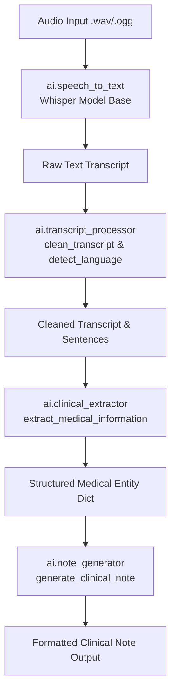
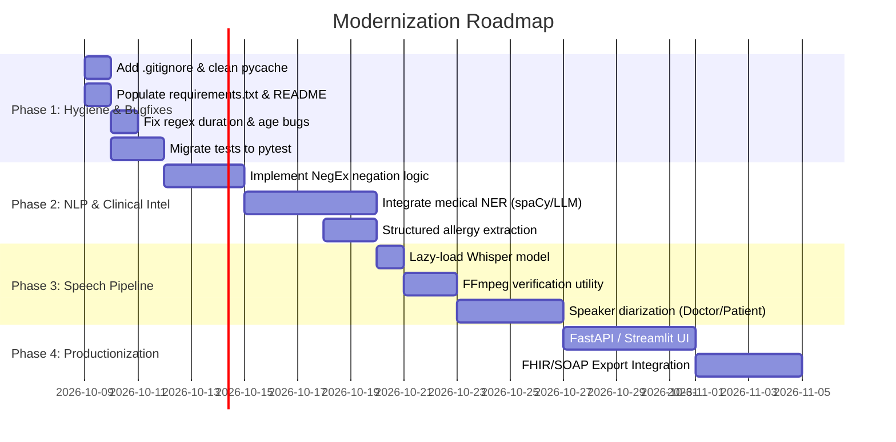

# Comprehensive Repository Analysis Report: AI-Clinical-Scribe

**Repository:** `AI-Clinical-Scribe`  
**Current Branch:** `feature/ai`  
**Analysis Date:** October 2026  
**Target Environment:** Python 3.10+ (Tested on Python 3.14.3, Windows)  

---

## 1. Executive Summary

The **AI-Clinical-Scribe** repository is an early-stage prototype designed to automate the clinical documentation process. Its conceptual workflow ingests patient-doctor audio consultations, transcribes the speech into text using OpenAI's Whisper, cleans and processes the transcript, extracts structured clinical entities (patient age, symptoms, duration, and allergies), and formats the extracted data into a standardized clinical note template.

### Current Maturity Level
- **Status:** Functional Proof-of-Concept (POC) / Pre-Alpha.
- **Strengths:** Clear separation of concerns in the `ai/` package, lightweight footprint, and intuitive pipeline stages.
- **Critical Gaps:**
  1. The project lacks a `.gitignore`, resulting in compiled `__pycache__` bytecode committed directly to git.
  2. `README.md` and `requirements.txt` are currently empty (0 bytes).
  3. Audio transcription crashes on standard environments lacking system-level `ffmpeg`.
  4. Audio test assets (`.wav`) are actually disguised Ogg Opus files.
  5. The clinical extraction layer relies on naive regex and substring matching, leading to significant false positives (e.g., misidentifying symptom durations as patient age), negation blindness (e.g., treating "no fever" as positive symptom "fever"), and regex alternative truncation (e.g., extracting "3 day" instead of "3 days").
  6. No automated testing framework (`pytest`/`unittest`) or assertions exist; test files are manual print scripts.

---

## 2. Repository Architecture & Directory Tree

```
AI-Clinical-Scribe/
├── .git/                               # Git version control metadata
├── ai/                                 # Core AI/NLP library package
│   ├── __init__.py                     # Package marker (empty)
│   ├── __pycache__/                    # [ISSUE] Committed Python bytecode files
│   │   ├── __init__.cpython-314.pyc
│   │   ├── clinical_extractor.cpython-314.pyc
│   │   ├── note_generator.cpython-314.pyc
│   │   ├── speech_to_text.cpython-314.pyc
│   │   └── transcript_processor.cpython-314.pyc
│   ├── clinical_extractor.py           # Regex-based clinical information extraction
│   ├── note_generator.py               # Formats clinical notes into text templates
│   ├── speech_to_text.py               # Audio transcription using OpenAI Whisper
│   └── transcript_processor.py         # Text cleaning, script detection, sentence segmentation
├── multilingual_conversation.wav       # Audio asset (Ogg Opus format, 80 KB)
├── test_audio.wav                      # Audio asset (Ogg Opus format, 22 KB)
├── test_extractor.py                   # Ad-hoc test runner for clinical_extractor
├── test_note.py                        # Ad-hoc test runner for note_generator
├── test_processor.py                   # Ad-hoc test runner for transcript_processor
├── test_speech.py                      # Ad-hoc test runner for speech_to_text
├── requirements.txt                    # [ISSUE] Empty dependency manifest
└── README.md                           # [ISSUE] Empty project documentation
```

### High-Level Data Flow



---

## 3. Component-by-Component Technical Analysis

### 3.1 `ai/speech_to_text.py`

#### Implementation
```python
import whisper

model = whisper.load_model("base")

def transcribe_audio(audio_file):
    result = model.transcribe(audio_file)
    return result["text"]
```

#### Technical Findings & Deficiencies
1. **Top-Level Eager Model Loading:** The Whisper model is loaded at the root module level (`model = whisper.load_model("base")`). Any script importing `ai.speech_to_text` (or any package importing it) immediately blocks execution while weights are downloaded from the internet or loaded into memory. This prevents lazy loading, hampers testing, and dramatically inflates startup latency.
2. **Missing System Dependency (`ffmpeg`):** OpenAI's Whisper uses `subprocess` to call `ffmpeg` for audio decoding. In standard environments where `ffmpeg` is not in the system `PATH`, calling `transcribe_audio()` immediately raises:
   ```
   FileNotFoundError: [WinError 2] The system cannot find the file specified
   ```
3. **CPU Warning Suppression:** On CPU runs, PyTorch raises `UserWarning: FP16 is not supported on CPU; using FP32 instead`. Passing `fp16=False` when calling `model.transcribe()` prevents unnecessary warnings.
4. **Discarded Metadata:** Whisper generates word/phrase timestamps, segment confidence, and detected language (`result["language"]`), but `transcribe_audio()` discards everything except `result["text"]`.
5. **No Medical Jargon Prompting:** Whisper accepts an `initial_prompt` parameter to bias vocabulary toward clinical terms, prescription names, and medical spellings. This is omitted.

---

### 3.2 `ai/transcript_processor.py`

#### Implementation Summary
- `clean_transcript(transcript)`: Removes filler words (`umm`, `uh`, `ah`, `you know`, `actually`), compresses whitespace, and normalizes punctuation.
- `detect_language(transcript)`: Counts Unicode character points for Telugu (`\u0C00-\u0C7F`) and Devanagari/Hindi (`\u0900-\u097F`). Returns `"Telugu"`, `"Hindi"`, or defaults to `"English"`.
- `split_into_sentences(transcript)`: Splits text using lookbehind regex `(?<=[.!?])\s+`.
- `organize_conversation(transcript)`: Wraps split sentences into a list of dictionaries with hardcoded type `"conversation"`.

#### Technical Findings & Deficiencies
1. **Aggressive & Destructive Filler Removal:**
   - Replacing `r"\byou know\b"` corrupts valid clinical questions:
     - Input: `"Do you know actually if I have any allergies?"`
     - Cleaned: `"Do if I have any allergies?"` (Corrupted grammar).
   - Filler removal should be context-aware or strictly limited to interjections (e.g., bracketed by commas or pauses).
2. **Flawed Language Detection:**
   - Counts Unicode characters. If text has 1 Telugu character and 1,000 Devanagari characters, it evaluates `if telugu_count > 0: return "Telugu"`, misclassifying the text as Telugu.
   - Completely misses transliterated Indian languages written in the Latin alphabet (e.g., Hinglish: *"Mujhe 3 din se bukhar hai"* is classified as `"English"`).
   - Whisper already performs native acoustic-based language identification; duplicating this in text using character ranges is brittle and unnecessary.
3. **Sentence Splitting on Medical Abbreviations:**
   - Splitting on `(?<=[.!?])\s+` fragments clinical abbreviations:
     - `"Dr. Smith prescribed 500 mg. amoxicillin"` becomes 3 separate fragmented sentences: `"Dr."`, `"Smith prescribed 500 mg."`, `"amoxicillin"`.
4. **Lack of Speaker Diarization:**
   - `organize_conversation()` tags all sentences as `type: "conversation"` without attributing dialogue to Doctor vs. Patient.

---

### 3.3 `ai/clinical_extractor.py`

#### Implementation Summary
Extracts patient metadata via regular expressions:
- `extract_age(transcript)`: `r"(\d{1,3})\s*(?:years old|year old|yrs old|years)"`
- `extract_symptoms(transcript)`: Checks against a hardcoded list of 10 common symptoms (`fever`, `cough`, `cold`, `headache`, `vomiting`, `nausea`, `pain`, `fatigue`, `dizziness`, `shortness of breath`).
- `extract_duration(transcript)`: `r"(?:past|for|from)\s+(\d+)\s+(day|days|week|weeks|month|months)"`
- `extract_allergies(transcript)`: Checks for `"no allergies"` or `"don't have any allergies"`.
- `extract_medical_information(transcript)`: Aggregates results into a dictionary.

#### Critical Bugs & Deficiencies

1. **Regex Order Truncation Bug in Duration Extraction:**
   - The regex is: `(day|days|week|weeks|month|months)`.
   - In standard regular expression evaluation, alternatives are matched left-to-right. `"day"` matches before `"days"`.
   - Result: `"past 3 days"` extracts `"3 day"`. `"for 2 weeks"` extracts `"2 week"`.
   - **Fix:** Order plurals first or use optional quantifier: `r"(?:past|for|from)\s+(\d+)\s+(days?|weeks?|months?)"`.

2. **Severe False-Positive Risk in Age Extraction:**
   - Matching `\d+\s+years` causes duration statements to be extracted as patient ages!
   - Example: `"I am suffering from severe back pain for 5 years."`
   - `extract_age()` extracts **`5`** as the patient's age. This is a severe clinical safety risk.
   - **Fix:** Anchor age extraction to self-referential terms (e.g., `"I am \d+ years old"`, `"patient is a \d+ y/o"`).

3. **Total Negation Ignorance (Critical Clinical Safety Bug):**
   - The symptom extractor does not implement negation handling (such as the NegEx algorithm).
   - If a patient states: *"I have no fever, no cough, and deny chest pain"*, `extract_symptoms()` extracts:
     `['fever', 'cough', 'pain']`.
   - Documenting denied symptoms as active chief complaints represents a significant patient safety hazard in healthcare software.

4. **Substring Matching False Positives:**
   - Uses `if symptom in text:` without word boundaries (`\b`).
   - Words like "sprain", "painting", "coldness" trigger symptom matches.

5. **Inability to Extract Positive Allergies:**
   - `extract_allergies()` only checks for absence of allergies.
   - If a patient explicitly states: *"I am allergic to penicillin and sulfa drugs"*, the system returns:
     `"Not mentioned"`.

---

### 3.4 `ai/note_generator.py`

#### Implementation Summary
Formats the dictionary from `clinical_extractor.py` into a plain-text clinical summary covering Patient Age, Chief Complaints, Duration, Allergies, Medical History, Medications, Assessment, and Plan.

#### Deficiencies
1. **Hardcoded Sections:**
   - Medical History and Medications are hardcoded as `"Not mentioned"`.
   - Assessment is hardcoded as `"Requires doctor review."`.
   - Plan is hardcoded as `"To be decided by the doctor."`.
2. **Missing SOAP Structure:**
   - While close to SOAP (Subjective, Objective, Assessment, Plan), it lacks Objective findings (vital signs, physical exam, lab results).
3. **No Structured Output Options:**
   - Outputs only raw string text; lacks JSON, Markdown, or FHIR (Fast Healthcare Interoperability Resources) clinical document output options.

---

## 4. Audio Asset & Media Inspection

The repository includes two audio files:
1. `multilingual_conversation.wav` (80,357 bytes)
2. `test_audio.wav` (22,067 bytes)

### Critical Asset Finding: Format Spoofing
- When reading headers, both files begin with:
  `b'OggS\x00\x02...OpusHead...'`
- **Finding:** Despite the `.wav` file extension, these files are **Ogg Opus** audio containers, NOT standard PCM RIFF WAV audio files.
- **Impact:**
  - Python's standard `wave` module immediately throws: `wave.Error: file does not start with RIFF id`.
  - Whisper relies on `ffmpeg` to transcode them. Because `ffmpeg` is not bundled or configured, loading these files fails completely out-of-the-box.

---

## 5. Quality Assurance, Test Suite & Execution Results

The test suite consists of four standalone test scripts in the root directory:
- `test_extractor.py`
- `test_note.py`
- `test_processor.py`
- `test_speech.py`

### Test Execution Matrix

| Test Script | Status | Output / Observation | Issue / Defect Detected |
|---|---|---|---|
| `test_extractor.py` | **PASS (Flawed)** | Extracted: `Age: 35`, `Symptoms: ['fever', 'cough']`, `Duration: 3 day` | Duration shows `"3 day"` instead of `"3 days"` due to regex precedence bug. |
| `test_note.py` | **PASS (Flawed)** | Note generated with duration `"3 day"`. | Same regex issue propagated into note output. |
| `test_processor.py` | **PASS (Destructive)** | Sentence cleaned to: `"Do if I have any allergies?"` | Filler removal destroyed legitimate grammatical structure. |
| `test_speech.py` | **FAIL (Crash)** | `FileNotFoundError: [WinError 2] The system cannot find the file specified` | System missing `ffmpeg` dependency required by Whisper. |

### Testing Deficiencies
- **Zero Assertions:** Tests only use `print()`; they do not assert expected results. Regressions will not cause automated test runners to fail.
- **No CI/CD:** No GitHub Actions or CI configuration exists to execute linting, type checking, or unit tests.

---

## 6. Bugs, Vulnerabilities, and Flaws Catalog

| ID | Component | Severity | Description | Impact |
|---|---|---|---|---|
| **BUG-01** | `speech_to_text.py` | **High** | Missing FFmpeg dependency handling and eager model loading. | Module crashes at runtime on systems without FFmpeg; import blocks thread. |
| **BUG-02** | `clinical_extractor.py` | **Critical** | Negation blindness in symptom extraction ("no fever" extracted as "fever"). | Clinical misdiagnosis risk; false documentation in electronic medical record. |
| **BUG-03** | `clinical_extractor.py` | **High** | False positive in age detection: matches symptom duration as age. | "Back pain for 5 years" extracted as Age 5. |
| **BUG-04** | `clinical_extractor.py` | **Medium** | Regex ordering in duration: `(day\|days)` evaluates `day` first. | "3 days" parsed as "3 day". |
| **BUG-05** | `clinical_extractor.py` | **Medium** | Positive allergies cannot be extracted (only negative checked). | Known patient allergies are dropped from note. |
| **BUG-06** | `transcript_processor.py` | **Medium** | Naive filler word removal corrupts valid English questions. | "Do you know actually..." becomes "Do if I have...". |
| **BUG-07** | `multilingual_conversation.wav` | **Low** | Mislabeled file extensions (Ogg Opus named as `.wav`). | Fails with standard WAV parsers. |
| **BUG-08** | Repository Root | **Medium** | Committed `__pycache__` and missing `.gitignore`. | Repository pollution; platform-specific bytecode in version control. |
| **BUG-09** | Repository Root | **Medium** | Empty `requirements.txt` and `README.md`. | Onboarding failure; dependency ambiguity for developers and deployers. |

---

## 7. Compliance, Security & Clinical Safety

1. **HIPAA & PHI Compliance:**
   - In a clinical setting, transcripts contain Protected Health Information (PHI).
   - Audio files and generated notes must not be stored in unencrypted temporary locations or committed to public Git repositories.
   - Any model inference (Whisper, LLMs) should run strictly on-premise/local or through HIPAA-compliant BAA endpoints.
2. **Clinical Safety & Legal Liability:**
   - Automated clinical notes must display prominent disclaimers requiring licensed clinician verification before entering patient medical records.
   - Negation handling and confidence scoring are mandatory before clinical deployment.

---

## 8. Strategic Roadmap & Recommendations



### Immediate Action Items
1. **Repository Clean-up:**
   - Add `.gitignore` ignoring `__pycache__/`, `*.pyc`, `.env`, and audio caches.
   - Remove committed `ai/__pycache__` files with `git rm -r --cached ai/__pycache__`.
   - Populate `requirements.txt` with exact tested packages:
     ```
     openai-whisper
     torch
     scipy
     pytest
     ```
   - Provide an informative `README.md` with setup guides, prerequisites (including FFmpeg installation instructions), and architecture diagrams.
2. **Speech Module Refactor:**
   - Encapsulate Whisper inside a class `SpeechToTextService` with lazy model initialization (`get_model()`).
   - Add automated check for `ffmpeg` availability with an actionable error message.
3. **Clinical Extraction Overhaul:**
   - Fix the duration regex quantifier: `r"(?:past|for|from)\s+(\d+)\s+(days?|weeks?|months?)"`.
   - Implement rule-based negation detection (or integrate `spaCy` with `negspacy` / `scispacy`).
   - Add support for extracting confirmed allergies and medication lists.
4. **Standardized Testing:**
   - Convert `test_*.py` files into automated `pytest` test suites with explicit assertions covering edge cases, abbreviations, and negations.
